

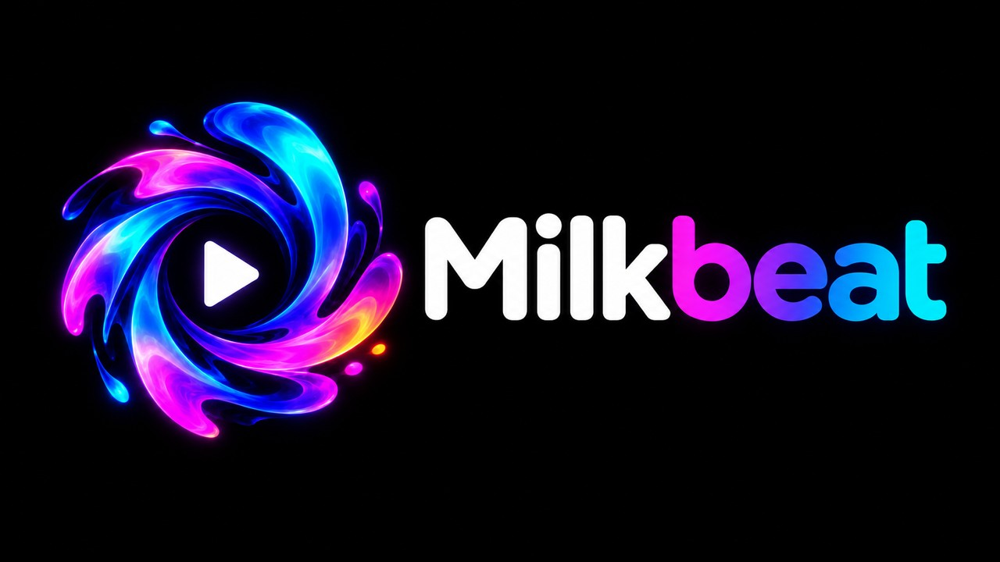

**A YouTube Music player for Android TV, with MilkDrop visuals behind every track.**

---

Milkbeat turns your TV into a YouTube Music player. It opens on your YouTube Music home, with the
same shelves in the same order as the YouTube Music app. Everything is built for the remote.

Behind the music runs [projectM](https://github.com/projectM-visualizer/projectm), the open-source
MilkDrop. It reacts to the track you are playing, and a music video can take its place whenever you like.

  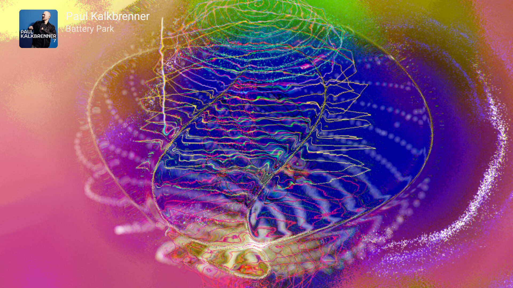

## Install on Android TV

| Method | How |
|---|---|
| **Downloader app** (Google TV, Fire TV, NVIDIA SHIELD) | Install [Downloader](https://www.aftvnews.com/downloader/) and enter code **`7170062`** |
| **Direct link** (always the latest build) | https://github.com/johnneerdael/Milkbeat/releases/latest/download/milkbeat-universal.apk |
| **All builds** | [Releases](https://github.com/johnneerdael/Milkbeat/releases): every push to `main` is published automatically, with release notes |

Each release also has smaller per-ABI APKs (`milkbeat-arm64-v8a.apk`, `milkbeat-armeabi-v7a.apk`).

**Requirements:** Android TV, Google TV or Fire TV on Android 8.0 or newer. Milkbeat is developed
and tested on an Ugoos AM6 (Amlogic S922X, 32-bit) and an Ugoos AM9 Pro (64-bit, Android 14).

**Coming from MusicViz?** Milkbeat is the same app under a new name and application id
(`nl.neerdael.milkbeat`), so it installs next to MusicViz instead of over it. Sign in again in
Milkbeat, then uninstall MusicViz. Downloader code `4718521` and the old `musicviz-universal.apk`
link still work, and now install Milkbeat.

## Your YouTube Music home

The Music tab shows your YouTube Music home: mood chips first, then every shelf, loaded to the end.
Each shelf keeps the style it has on YouTube Music:

- Quick picks as a grid of rows
- square cards for albums, mixes and playlists
- round cards for artists
- wide cards for music videos and live performances
- "Similar to" and "Listen again" shelves under their artist or account header

Moving down enters each shelf at its first item. Play all sits in the shelf header.

<table>
  <tr>
    <td>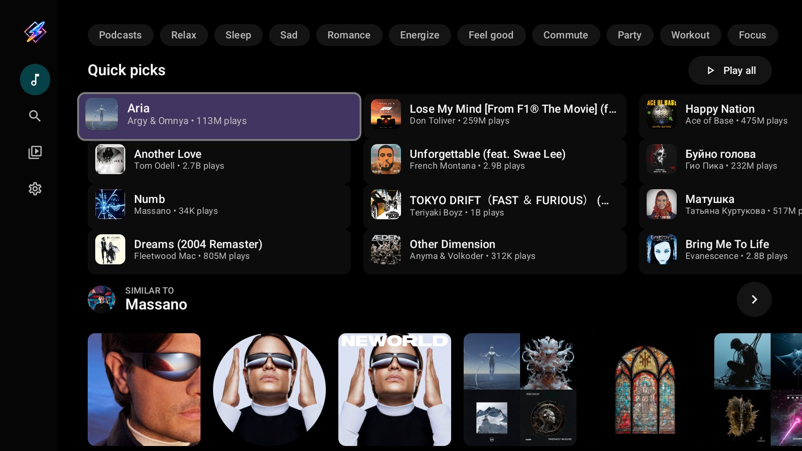</td>
    <td>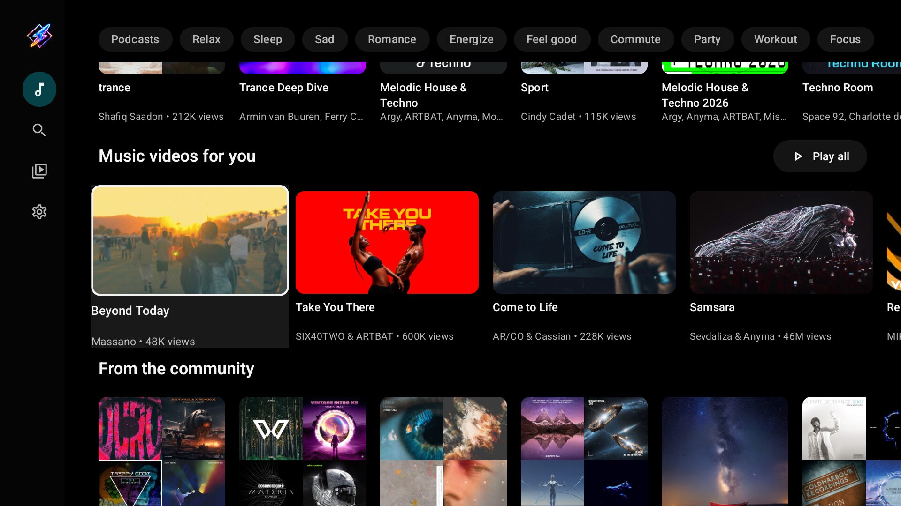</td>
  </tr>
  <tr>
    <td>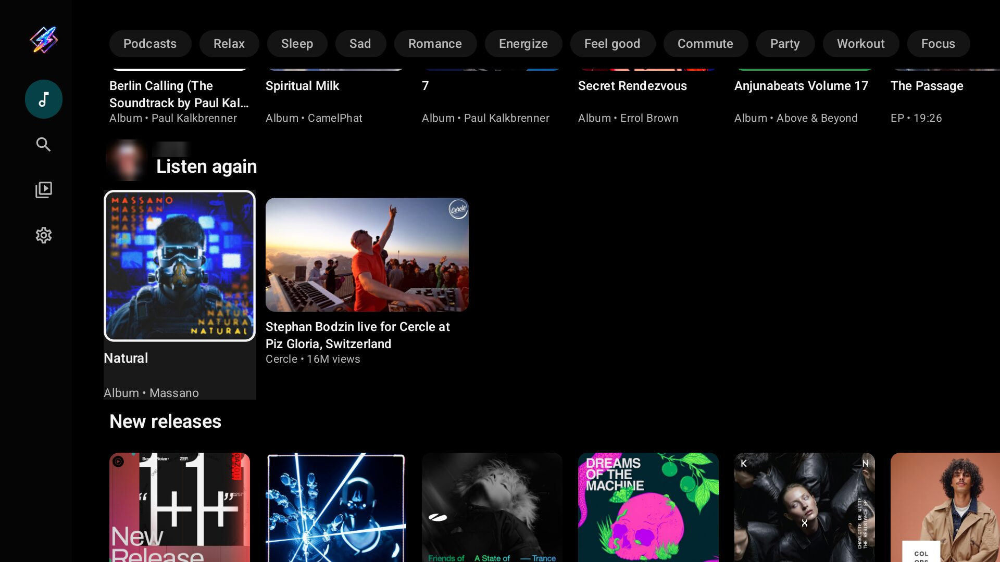</td>
    <td>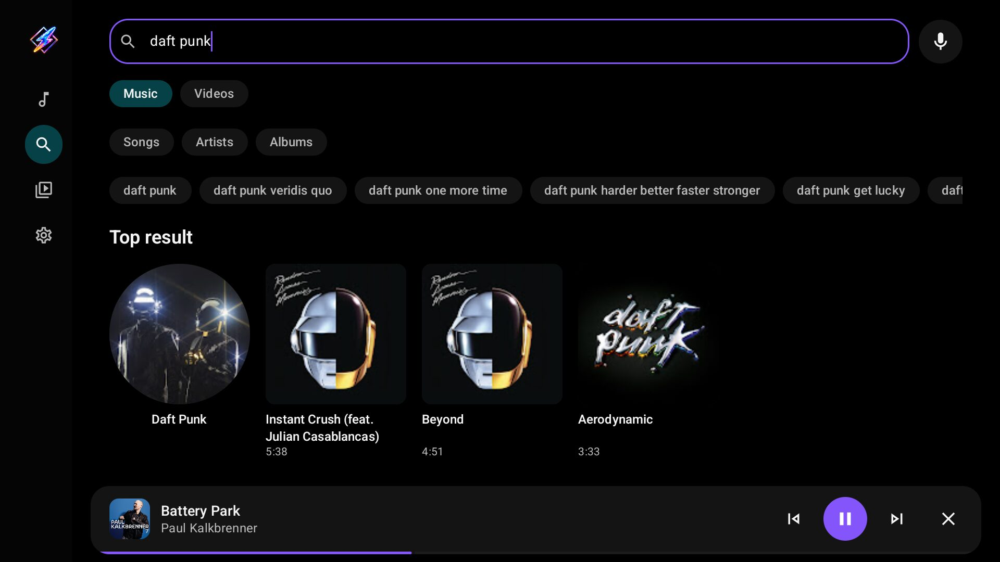</td>
  </tr>
</table>

**Sign in with your phone:** go to Settings > Account > *Sign in with phone* on the TV. It shows a
QR code: scan it with a phone on the same network and log in there. Once signed in:

- Music and Library show your own feeds.
- Tracks you play for 30 seconds or more go to your YouTube history, so the recommendations learn
  your taste. You can switch this off in Settings > Account.

Without an account you get the regular YouTube Music home.

## Artists, albums and playlists

Pages are laid out like YouTube Music on the web:

- **Albums and playlists** keep the cover, details, Play and Shuffle on the left, with the tracks
  beside them. More from the artist and related releases follow below, at full width. From Play or
  Shuffle, Right jumps to the first track and Down to the releases.
- **Artists** open on their name, audience and a round portrait. Below come Play, Shuffle, Mix and
  Subscribe, then Top songs, Albums, Singles, Videos, Live performances and more.

<table>
  <tr>
    <td>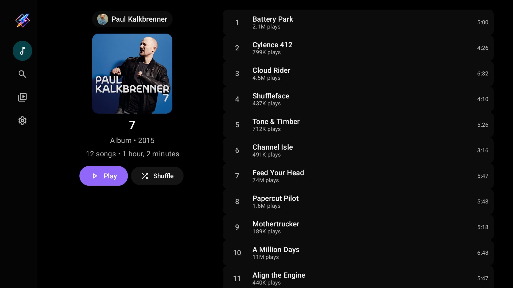</td>
    <td>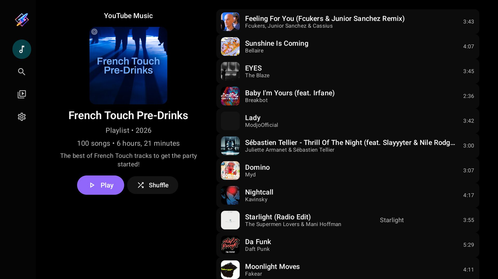</td>
  </tr>
  <tr>
    <td>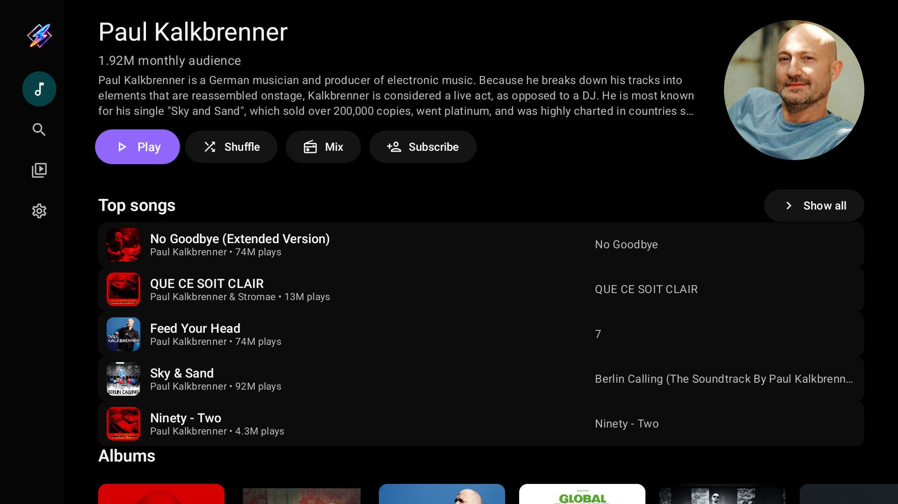</td>
    <td>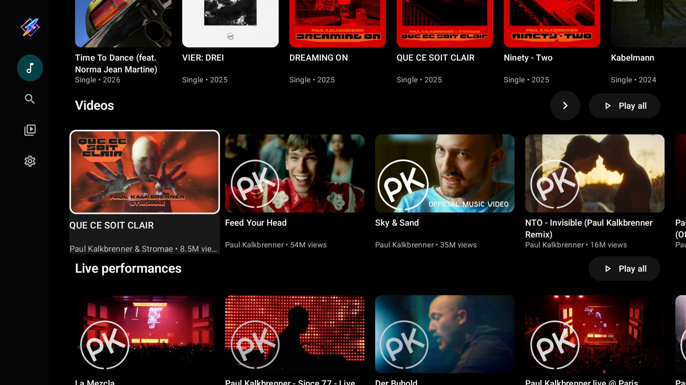</td>
  </tr>
</table>

## A queue that continues like YouTube Music

The queue never shuffles in random tracks. It follows what YouTube Music itself queues:

- **A song** plays its own mix, the same radio YouTube Music builds for it.
- **An album or playlist** plays through, then continues with YouTube Music's similar content for
  that collection. This applies to 100-track playlists too.
- **Artists you hide** stay out of every mix.

Tracks follow each other without a gap. The queue panel shows what is coming and lets you jump
anywhere in it.

## Now playing: visuals or the music video

The player fills the screen with projectM: 9,606 presets from Jason Fletcher's *Cream of the
Crop* collection, blending from one to the next. The visuals take their sound straight from
Milkbeat's player, so they follow the track you hear and not the TV's output.

- **Left and Right** step through presets while the controls are hidden.
- **OK** shows the controls: seek bar, shuffle, previous, play/pause, next, repeat, like, the
  Video/Visualizer switch and the queue.
- **Visualizer timing** in Settings > Visualizations moves the visuals earlier or later against the
  sound, from -100 ms to +200 ms (on an Ugoos AM6, +75 ms is about right).
- **Diagnostics**: an optional status line with frame rate, render size, blend state, audio level
  and preset name.

<table>
  <tr>
    <td>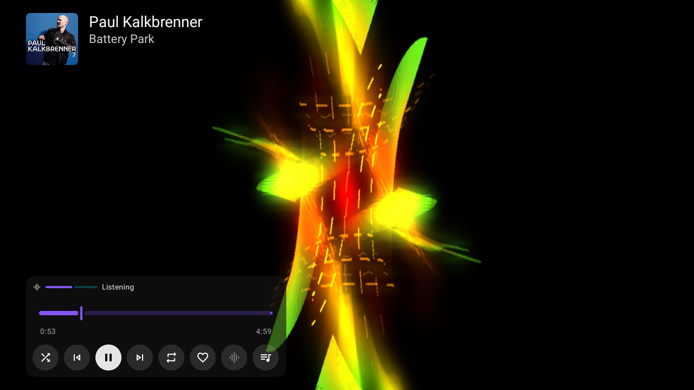</td>
    <td>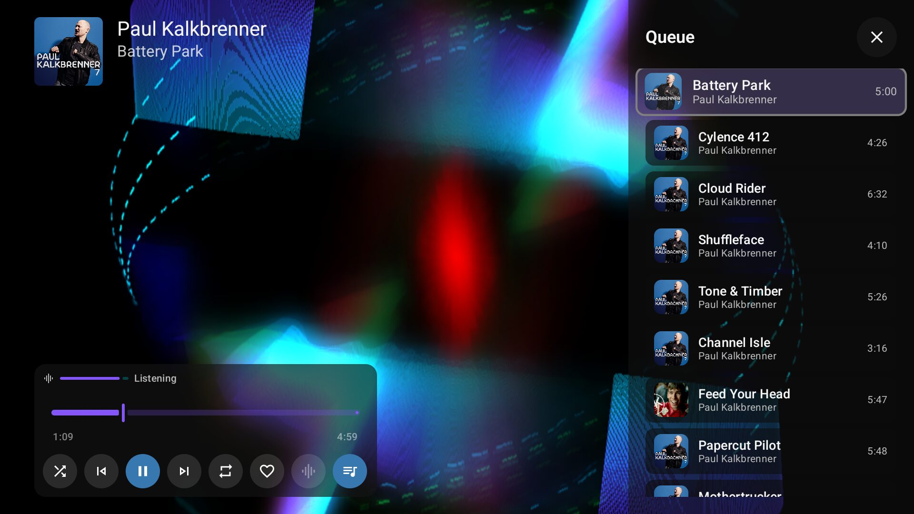</td>
  </tr>
</table>

**Music videos:** a track that YouTube Music lists as a video can play its video instead of the
visuals. The Video button in the controls switches between the two while the sound keeps
playing. It is dimmed on tracks without a video.

- The picture is picked for your TV: at most 1080p, in a codec the TV decodes in hardware.
- If a video can't be played, the track carries on as audio with the visuals.
- **Show music videos** in Settings > Visualizations makes video tracks start in video. It is off
  by default, so the visuals come first.

<table>
  <tr>
    <td>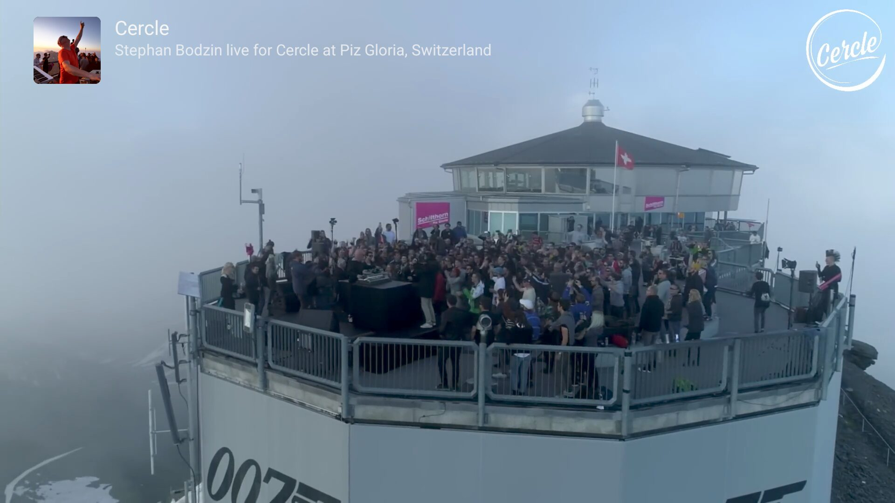</td>
    <td>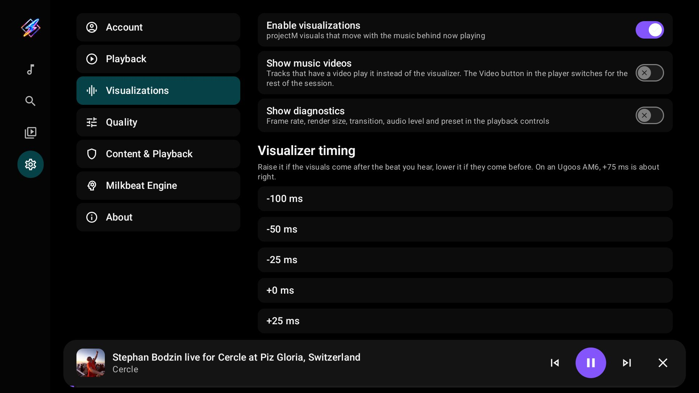 Visualizations with the music video and timing options"></td>
  </tr>
</table>

## Search and Library

- **Search** opens on Music, with filters for songs, artists and albums, and search suggestions. **Videos** covers everything else (channels, playlists, live) and is handy for DJ sets and
  concert recordings.
- **Library** has your history, likes and playlists, plus your YouTube Music library when you are
  signed in.
- Background playback is on by default, so the music keeps going when you leave the app.
- There are no ads, analytics or tracking. An on-device recommendation engine works alongside
  YouTube's own recommendations.

## Where it's heading

Home and the artist, album and playlist pages are built through a metadata provider contract, and
YouTube Music is its first provider. Other catalogs can plug into the same pages later. The next
planned provider is Spotify metadata, played through YouTube.

## Verifying authenticity

Check the signing certificate of a downloaded APK with a tool such as
[AppVerifier](https://github.com/soupslurpr/AppVerifier).

**Milkbeat release certificate SHA-256 fingerprint:**
`FE:FB:39:D0:D5:F3:DF:3B:BB:D0:B7:CC:F7:FE:D7:16:A0:A1:3E:BD:17:AC:52:9B:0C:1A:8E:C3:C1:F7:A3:F8`

## Built on

Milkbeat is a fork of [Flow](https://github.com/A-EDev/Flow) by A-EDev, which laid the groundwork:
the player, YouTube and YouTube Music extraction, and the on-device recommendation engine.

It also builds on:

- **[projectM](https://github.com/projectM-visualizer/projectm)**, the visualizer, through
  [ProjectM TV](https://github.com/johnneerdael/ProjectM-TV), with presets from Jason Fletcher's
  *Cream of the Crop* collection (CC0)
- **[Metrolist](https://github.com/MetrolistGroup/Metrolist)**: the YouTube Music home, radio and
  mix behaviour the queue follows
- **[NewPipeExtractor](https://github.com/TeamNewPipe/NewPipeExtractor)** and
  **[NewPipe](https://github.com/TeamNewPipe/NewPipe)**: YouTube data extraction
- **[PipePipe](https://codeberg.org/NullPointerException/PipePipe)** and its
  [developer docs](https://priveetee.github.io/Docs-PipePipe/): SABR and InnerTube playback
- **[LibreTube](https://github.com/LibreTube/LibreTube)**: SponsorBlock and DeArrow handling
- **[Media3 / ExoPlayer](https://github.com/androidx/media)**,
  **[Jetpack Compose](https://developer.android.com/jetpack/compose)** and
  **[Material Design 3](https://m3.material.io/)**

## License

Milkbeat is free software under the **GNU General Public License v3**: see [License](License).
Any project that uses this source code, including the recommendation engine, must also be
released under the GPLv3.

Copyright © 2025-2026 A-EDev (Flow) · Copyright © 2026 John Neerdael (Milkbeat changes)
