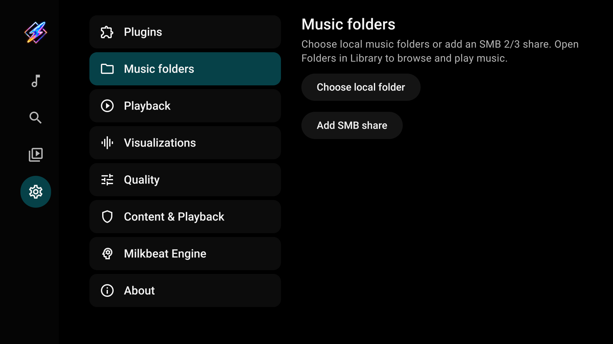
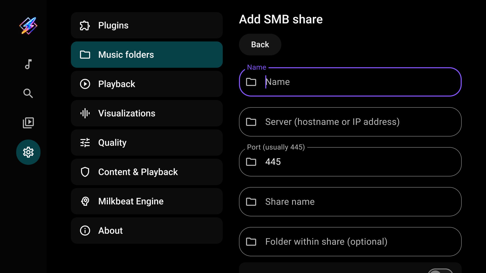
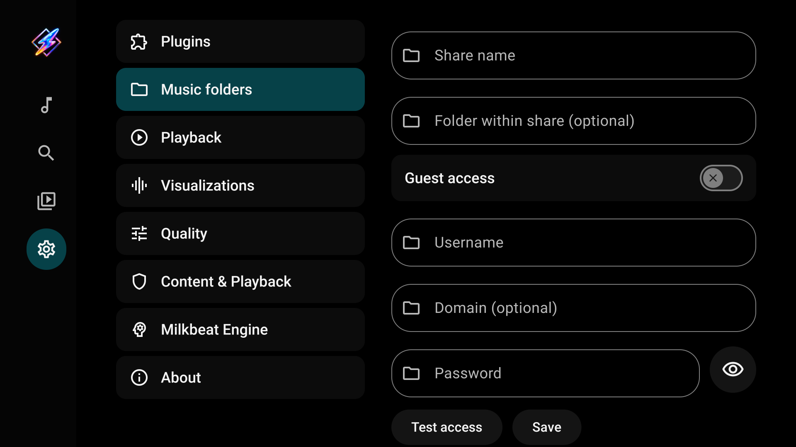

# Local folders and SMB shares

[User guide](index.md)

## Add a local or USB folder

1. Open Settings → Music folders.
2. Select **Choose local folder**.
3. In Android's folder picker, choose the folder and grant access.
4. Open Library → Folders and select the saved source.

A USB drive must be mounted and exposed by the device's folder picker. Folder-picker support differs between TV devices. The grant applies to the chosen folder and its children; moving or disconnecting storage can make the source unavailable.

## Add an SMB share

Open Settings → Music folders → **Add SMB share**.

| Field | Enter |
| --- | --- |
| Name | A label for this source |
| Server | The hostname or IP address, without `smb://` |
| Port | Usually `445` |
| Share name | The exported share's name, such as `Music` |
| Folder within share | Optional path beneath that share; leave empty for its root |
| Guest access | Enable only when the server permits guest access |
| Username / Password | The account the server accepts when guest access is off |
| Domain | Optional; use it only if your server requires one |

Select **Test access**. When access is confirmed, select **Save**. Testing alone does not save the source. Milkbeat supports SMB 2/3 and reads files without modifying the share. The password field has a Show/Hide control; leaving an existing saved password unchanged keeps it.

## Browse and play

In Library → Folders, select a source, then a folder. **Parent folder** moves up within the source. Select a track to play it, or **Play folder** to queue music in the current folder. Playback does not require a metadata or audio plugin.

Embedded title, artist, album, duration and cover art load in the background for visible or playing tracks. MP3, FLAC and M4A have been tested; other formats depend on device codecs. Files without readable tags fall back to their filenames and source labels.

## Refresh, edit or remove

Use **Refresh** to reload a source's listing and metadata. Open the source in Settings → Music folders to edit or remove it. Removing the source removes Milkbeat's configuration, not the music files on the storage device or server.

Folder music currently uses folder browsing and a bounded memory cache. It does not maintain a persistent whole-library catalog with artist, genre or record-label browsing.
