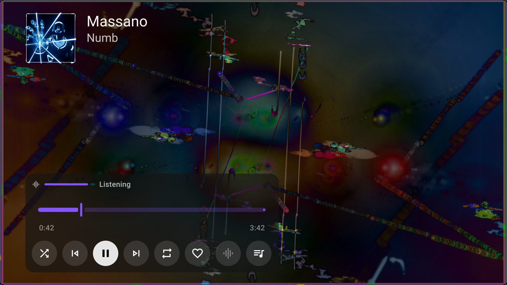
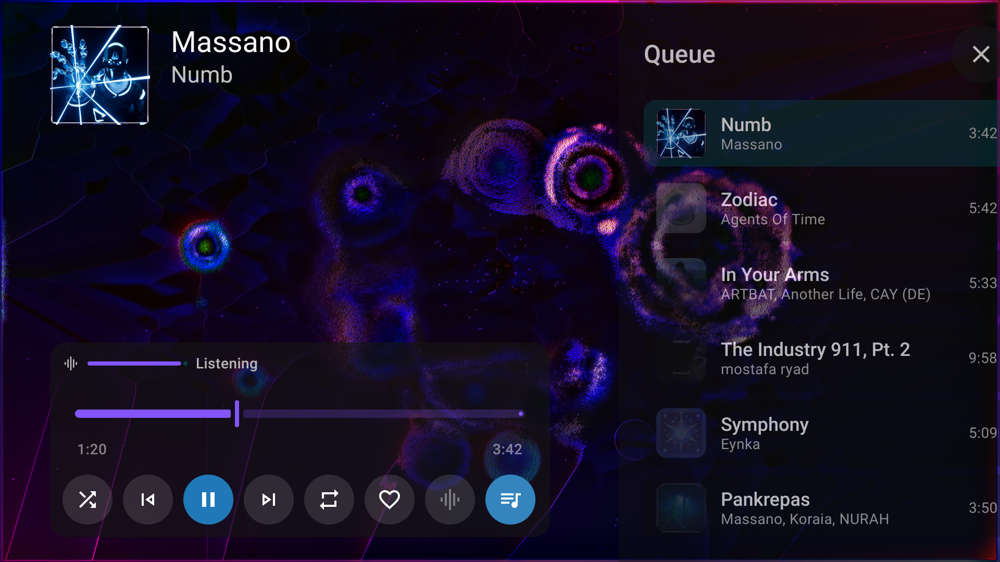
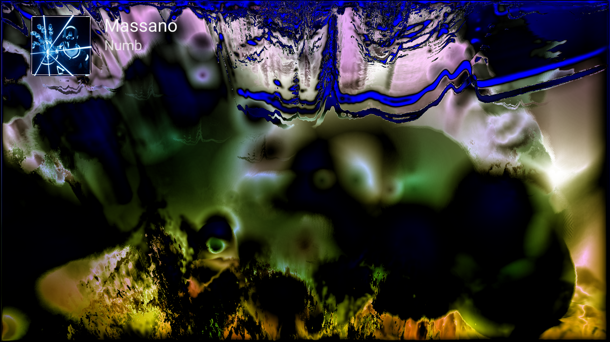

# Playback, queues and visuals

[User guide](index.md)

## Player controls

Press OK in the full music player to show seeking, shuffle, previous, play/pause, next, repeat, like, the video/visualizer switch and the queue. Back closes the current panel or player surface.

## Queues and preparation

Open the queue to inspect upcoming tracks or jump to one. Holding Up or Down accelerates scrolling. Queue preparation follows playback order and resolves up to 100 upcoming entries one at a time while music plays. Jumping elsewhere updates that window.

Confirmed unmatched tracks can be removed from the future queue. Temporary failures remain retryable. Preparation reduces the work needed at a transition, but does not guarantee gapless playback under every network, format or provider condition.

## Mixes

YouTube Music tracks can continue with their YouTube mix. Albums and playlists can hand over to related content after their listed tracks. When the metadata provider has no radio, Milkbeat tries compatible audio providers in priority order. Spotify tracks can use the mix of their matched YouTube recording.

Local folder playback is independent of provider radio. **Play folder** queues tracks from the current folder.

## MilkDrop visualizer

The visualizer uses projectM through ProjectM TV, with 9,606 Cream of the Crop presets. Its input comes from Milkbeat's player. With controls hidden, Left and Right step through presets.

The embedded engine targets 30 fps and uses automatic resolution, automatic transitions, memory limits and slow-preset skipping. These settings adapt to the device; the target is not a promise that every preset reaches 30 fps. Performance varies by preset and device.

Rendering and audio monitoring stop when the visualizer leaves the screen or the app goes into the background. A visible visualizer can keep drifting on silence when music is paused.

## Timing and diagnostics

Settings → Visualizations contains the visualizer switch, music-video default, diagnostics and timing offset. Raise the timing value if the visuals arrive after the beat; lower it if they arrive before. Adjust by listening and watching on your own audio setup.

Diagnostics show measured fps, target fps, render dimensions, transition state, audio level and preset. Use these values when investigating slow visuals instead of judging performance from a still screenshot.

## Music videos

Supported music-video tracks can switch from visuals to their picture while audio continues. Unsupported or unavailable video can fall back to audio and visuals. **Show music videos** changes the starting preference; the player switch changes it for the current session.

