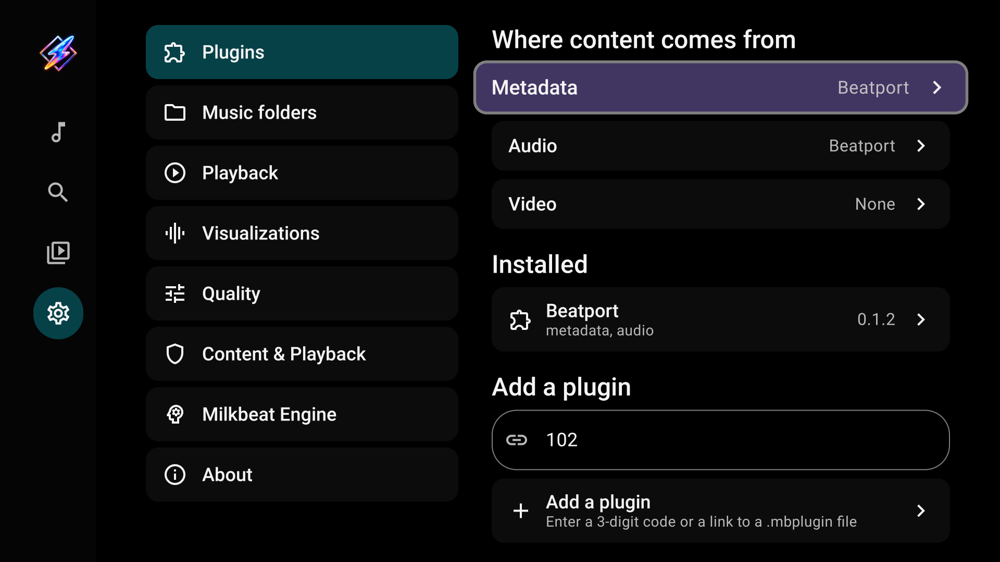
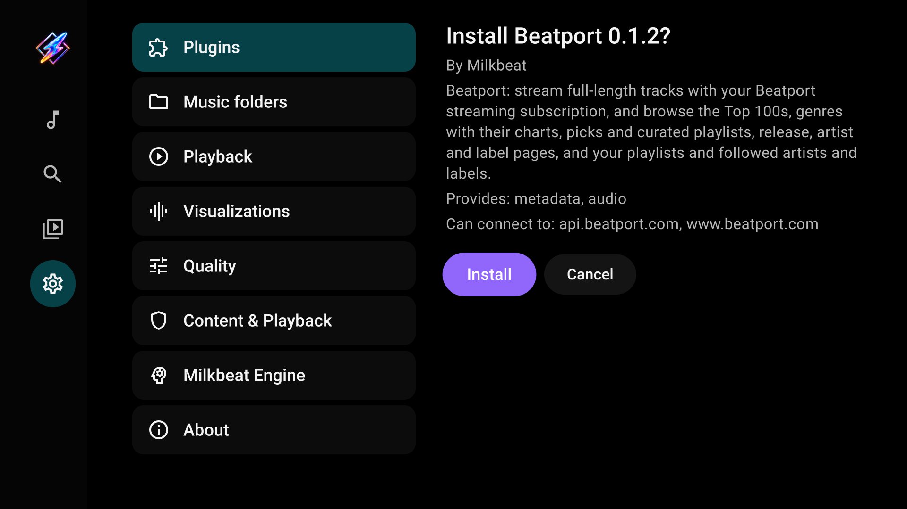

# Providers and phone sign-in

[User guide](index.md)

## Understand the three roles

| Role | Controls |
| --- | --- |
| Metadata | Music Home, music search, artist/album/playlist pages and account libraries |
| Audio | Streams and matches for tracks described by metadata providers |
| Video | Video search and playback |

A plugin can provide more than one role. Local and SMB playback are built in and need none of these roles.

## Install a third-party plugin

1. Open Settings → Plugins.
2. Enter a registered 3-digit third-party plugin code or a third-party plugin download URL. Plugin packages are distributed separately from Milkbeat app releases.
3. Select **Add a plugin**.
4. Review its author, roles and requested access, then install it.

### Download codes

| Code | Plugin |
| --- | --- |
| **393** | Beatport |
| **981** | Spotify |
| **494** | YouTube Music |

Codes need a Milkbeat build with download-code support; earlier releases accept URLs. Each code identifies a registered download in the app's bundled catalog. An unknown code reports an error; try its full URL or update the app.

Full URLs still work, including supported Buzzheavier file pages. An address without a scheme defaults to HTTPS. Milkbeat resolves Buzzheavier's download link, downloads the package, and verifies its signature before offering installation.

These two captures show the code-enabled development build. New catalog entries are delivered in app updates; codes do not automatically update installed plugins.

| Plugin | Metadata | Audio | Video |
| --- | --- | --- | --- |
| YouTube Music | Home, Search, artists, albums, playlists, library | Streams, cross-provider matching and radio | YouTube videos, channels and playlists |
| Spotify | Home, Search, artists, albums, playlists, library | **None — select a separate audio provider** | None |
| Beatport | Catalog, genres, charts, artists, labels, library | Full streams with a streaming subscription | None |

## Sign-in and account requirements

- **YouTube Music:** sign-in is optional. Signing in changes Home into a personalized feed based on the account and makes its library available. Free YouTube accounts are supported; Premium is not required for this personalization.
- **Spotify:** a metadata provider with **no audio source**. It can technically access catalog metadata without sign-in, but its practical value is your personalized feed, playlists, Liked songs and library after signing in. Select a separate audio provider for playback.
- **Beatport:** requires sign-in and an active Beatport streaming subscription to be useful in Milkbeat. Without those, it provides no usable listening experience.

## Select metadata and video

Under **Metadata**, choose the catalog for the Music tab. Under **Video**, choose the video provider. Changing metadata changes Home and music search; it does not remove folders or playlists from other signed-in providers in Library.

## Set audio priority

Under **Audio**, enable the providers you want to use. Select **Move earlier** or **Move later** to change their order, then **Done**.

For example, YouTube Music first and Beatport second means Milkbeat tries YouTube first. If it cannot find or play a recording, it tries Beatport. Availability depends on each catalog, account and subscription.

## Spotify with YouTube audio

Select Spotify for metadata and YouTube Music for audio. Spotify supplies the catalog and playlists; YouTube supplies a matched recording. The playing recording can differ from the catalog entry. Supported YouTube audio radio can continue with the matched track's mix.

## Sign in on your phone

Open the installed plugin's details and choose its sign-in method. Scan the TV's QR code with a phone on the same network. The phone viewer streams the actual provider page on the TV: use touch and typing to complete sign-in and provider verification.

The viewer handles sign-in. Music browsing and playback remain in Milkbeat's TV interface. An expired account needs sign-in again; local folders remain usable.

## Index playlists

In a signed-in metadata plugin's details, select **Index playlists**. Tracks and Liked songs are matched against audio providers in priority order. Completed matches are reused during playback and kept if indexing is cancelled. Re-index after changing the account, plugin or audio-provider order.

## Update or remove a plugin

Enter its download link again to fetch the current package. Milkbeat presents the update for review; it must have the same signing author and cannot be older than the installed version. Plugin updates are separate from app updates.

Select an installed plugin to inspect its account, sign out or remove it. Removing a plugin does not remove local music sources.

## Separate plugin releases

Plugin implementations, building and signing live in a separate private repository on Forgejo. Milkbeat app releases contain APKs and checksums; plugin packages are downloaded separately through the codes above. The original codes **102** (Beatport), **772** (Spotify) and **416** (YouTube Music) remain supported.
