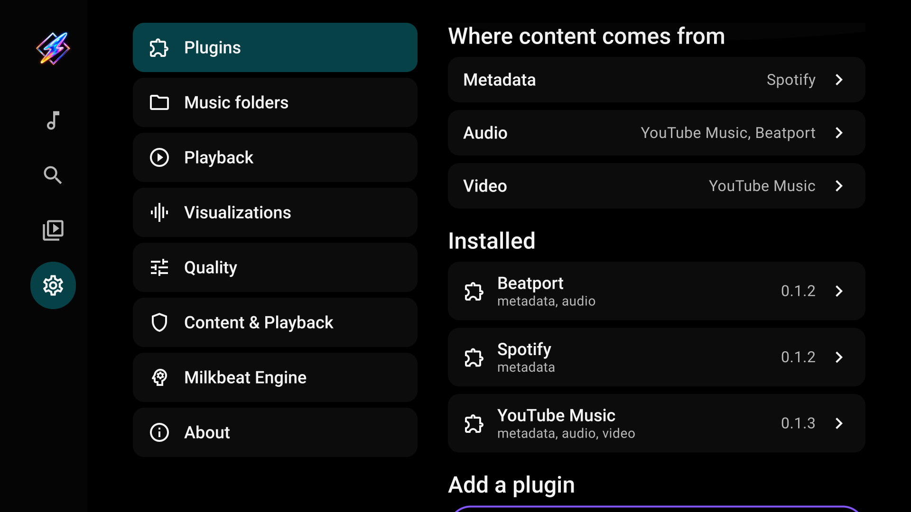
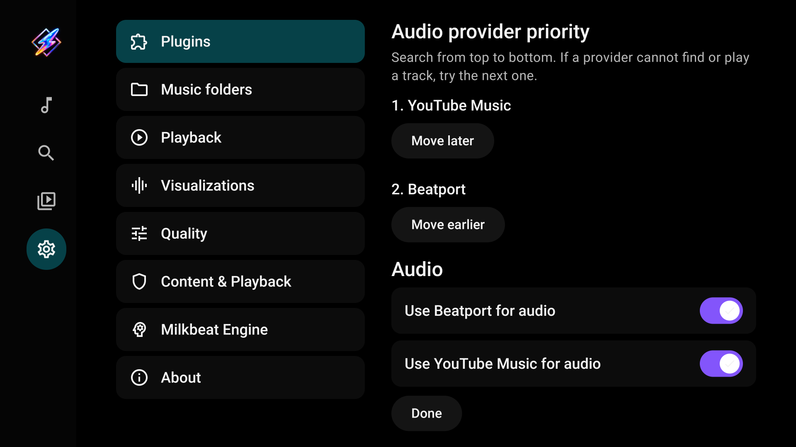
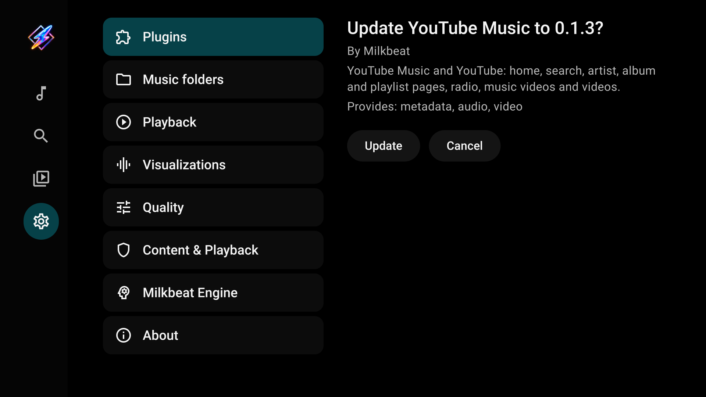

# Providers and phone sign-in

[User guide](index.md)

## Understand the three roles

| Role | Controls |
| --- | --- |
| Metadata | Music Home, music search, artist/album/playlist pages and account libraries |
| Audio | Streams and matches for tracks described by metadata providers |
| Video | Video search and playback |

A plugin can provide more than one role. Local and SMB playback are built in and need none of these roles.

## Install a plugin

1. Open Settings → Plugins.
2. Enter the download link for a `.mbplugin` package from a [release](https://github.com/johnneerdael/Milkbeat/releases/latest).
3. Select **Add a plugin**.
4. Review its author, roles and requested access, then install it.

An address without a scheme defaults to HTTPS. The host verifies the package signature before installation.

| Plugin | Metadata | Audio | Video |
| --- | --- | --- | --- |
| YouTube Music | Home, Search, artists, albums, playlists, library | Streams, cross-provider matching and radio | YouTube videos, channels and playlists |
| Spotify | Home, Search, artists, albums, playlists, library | Select a separate audio provider | None |
| Beatport | Catalog, genres, charts, artists, labels, library | Full streams with a streaming subscription | None |

## Select metadata and video

Under **Metadata**, choose the catalog for the Music tab. Under **Video**, choose the video provider. Changing metadata changes Home and music search; it does not remove folders or playlists from other signed-in providers in Library.

## Set audio priority

Under **Audio**, enable the providers you want to use. Select **Move earlier** or **Move later** to change their order, then **Done**.

For example, YouTube Music first and Beatport second means Milkbeat tries YouTube first. If it cannot find or play a recording, it tries Beatport. Availability depends on each catalog, account and subscription.

## Spotify with YouTube audio

Select Spotify for metadata and YouTube Music for audio. Spotify supplies the catalog and playlists; YouTube supplies a matched recording. The playing recording can differ from the catalog entry. Supported YouTube audio radio can continue with the matched track's mix.

## Sign in on your phone

Open the installed plugin's details and choose its sign-in method. Scan the TV's QR code with a phone on the same network. The phone viewer streams the actual provider page on the TV: use touch and typing to complete sign-in and provider verification.

The viewer handles sign-in. Music browsing and playback remain in Milkbeat's TV interface. An expired account needs sign-in again; local folders remain usable.

## Index playlists

In a signed-in metadata plugin's details, select **Index playlists**. Tracks and Liked songs are matched against audio providers in priority order. Completed matches are reused during playback and kept if indexing is cancelled. Re-index after changing the account, plugin or audio-provider order.

## Update or remove a plugin

Enter its download link again to fetch the current package. Milkbeat presents the update for review; it must have the same signing author and cannot be older than the installed version. Plugin updates are separate from app updates.

Select an installed plugin to inspect its account, sign out or remove it. Removing a plugin does not remove local music sources.
