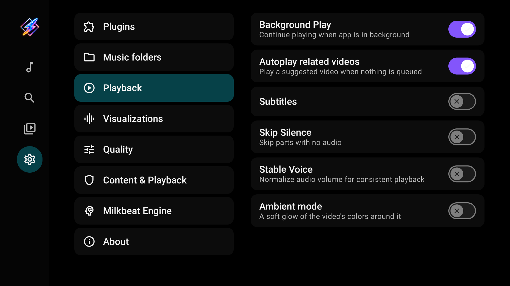
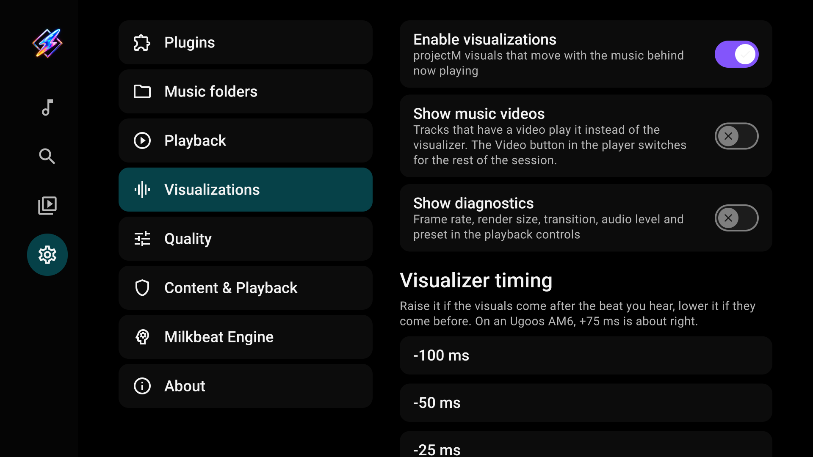
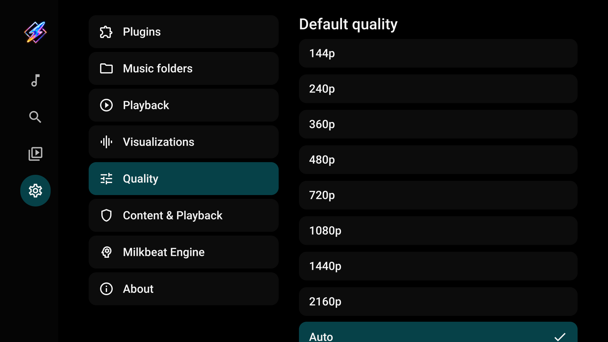
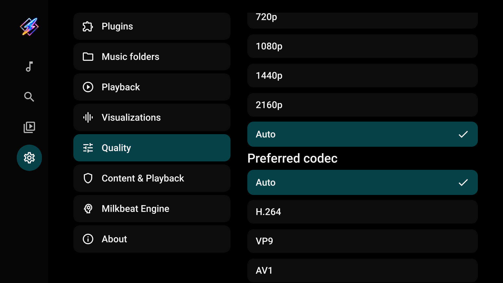
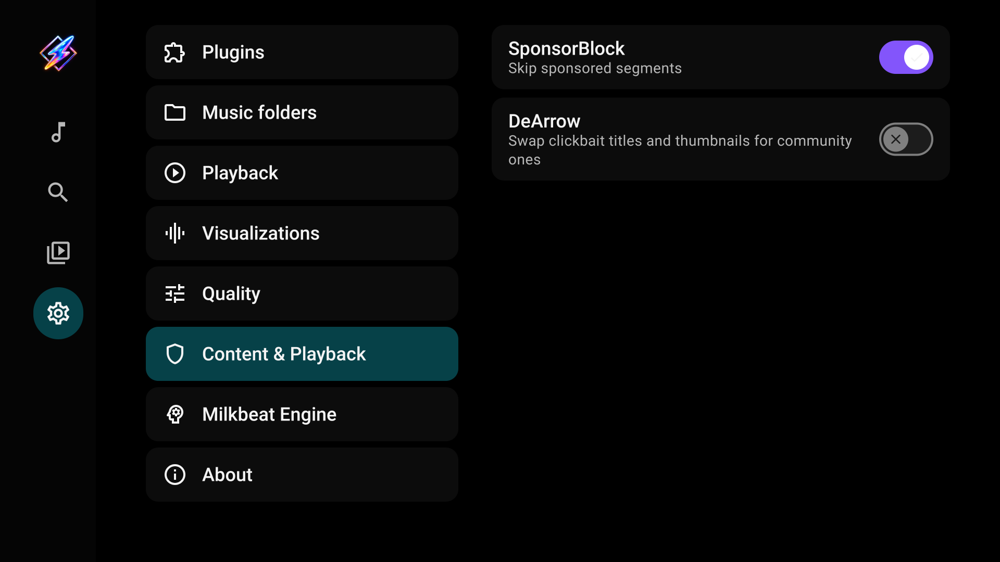
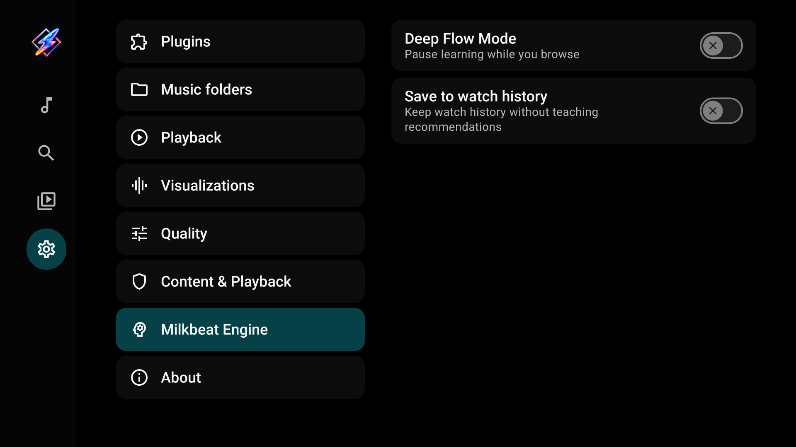
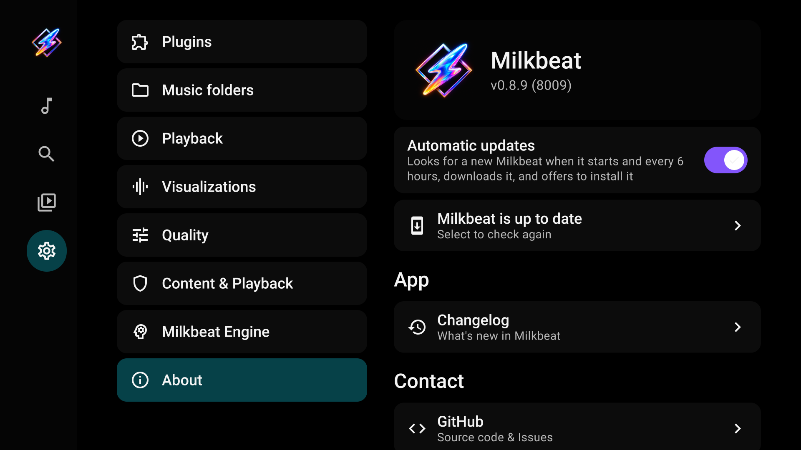

# Settings reference

[User guide](index.md)

Settings uses a category list on the left and its controls on the right. Change only the options relevant to your listening setup.

## Plugins

Install packages, select metadata/audio/video roles, set audio priority, manage provider sign-ins and play-history reporting, and index supported provider playlists. See [Providers](providers.md).

## Music folders

Choose local folders, add SMB shares, test access, and edit or remove sources. See [Folders](folders.md).

## Playback

| Setting | Purpose |
| --- | --- |
| Background Play | Allow playback to continue outside the app |
| Autoplay related videos | Play a suggested video when nothing is queued |
| Subtitles | Set the default subtitle preference |
| Skip silence | Skip supported silent sections |
| Stable Voice | Normalize supported audio for more consistent volume |
| Ambient mode | Use the existing video ambient background effect |

## Visualizations

| Setting | Purpose |
| --- | --- |
| Enable visualizations | Enable projectM on supported devices |
| Show music videos | Start supported video tracks with their picture instead of visuals |
| Show diagnostics | Show frame rate, render size, transition, audio level and preset information |
| Visualizer timing | Offset visual input timing from −100 ms to +200 ms |

Frame rate, automatic resolution and adaptive transition behavior use upstream engine defaults rather than separate manual controls. See [Playback and visuals](playback.md).

## Quality

Set the preferred video resolution and codec. Auto lets the player choose for the device and available streams. This category concerns video playback; it is not the projectM visualizer's render-resolution setting. Provider streams and hardware decoding capabilities still determine what is available.

## Content & Playback

**SponsorBlock** controls skipping of supported community-marked video segments. **DeArrow** controls supported alternative title/thumbnail handling. These options concern supported video content, not local-file tags.

## Milkbeat Engine

Enable **Deep Flow Mode** to pause recommendation learning while you browse. **Save to watch history** keeps history without teaching recommendations while that mode is active. These controls are separate from a provider's own account history reporting.

## About

View app/build information and update controls. The GitHub build provides automatic app updates and manual update checking. Update availability depends on the release service and device installer. The FOSS flavor does not include the app updater.

App updates and plugin updates are separate. Installing a signed release over the existing Milkbeat package preserves app data; uninstalling first does not.
